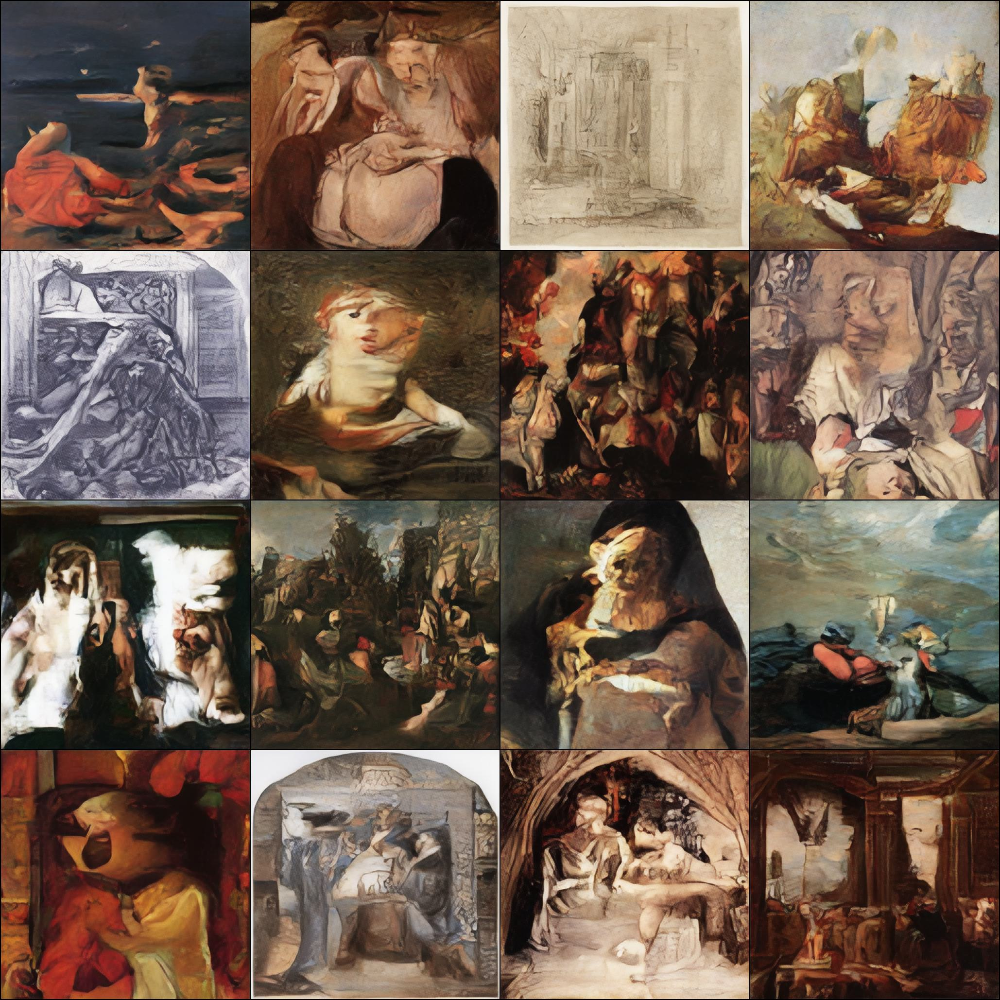

# Latent Diffusion with DDPM and DDIM samplers from scratch in PyTorch


# Overview
<p>This implementation of Latent Diffusion uses VAE (Variational Auto Encoder). I tried both VQ (vector quantized) and
the VAE variants and VAE seemed to produce more accurate reconstruction when latent dimension is not large.</p>
<p>The forward diffusion process acts on latent space of the VAE with cosine noise scheduler. The reverse denoising is 
performed with a simple UNet with LinearAttention layers in each down- and up-sampling blocks.</p>
<p>See next few sections for a brief description of the architectures.</p>

Finally, the models were trained on [500K](https://deepart.hkust.edu.hk/ART500K/art500k.html) 
and [WikiArt](https://archive.org/download/wikiart-dataset/wikiart.tar.gz) datasets. If you decide to repeat the training, note that the 500K 
dataset contains some broken files. Practice shows that deletion of all files smaller than 5 Kb solve problems. Finally,
the conditioned UNet was conditioned on style, not genre and painter as of this iteration.

**Requirements:**
- PyTorch 2.0
- PIL & torchvision
- [Einops](https://einops.rocks/)
- [TorchMetrics](https://torchmetrics.readthedocs.io/en/stable/) 
with [LPIPS](https://github.com/richzhang/PerceptualSimilarity) module installed

### VAE architecture
<p>Encoder part has a compression stack followed by mid-block with attention and post-encoder. The compression stack
is based on a consequent combination of a ResNet block, linear attention layer (optionally, 
controlled by a config), and a resampler 
if not the last layer in the compression stack. 
The donwsampler is either MaxPooling or Averaging layer and
can be chosen from the config. </p>
The "mid-block" is made of 2 ResNet blocks with a 
linear attention layer in between. Finally, post-encoder convolution layer matches the output 
dimension of the compression stack and the desired dimension of the latent space.
<p>Decoder part follows exactly the same structure with only difference that upsampler is an instance or torch.nn.Upsample(). 
Upsampling method is controllable by the config."</p>

*Final note.* The code contains a legacy part with possibility to use strided convolutions for downsampling and 
a transposed convolution for upsampling. These are left from the very early days of the project as part of legacy and 
should not be used due to checkerboard patterns arising from this combination.

### UNet
UNet is formed from the same downsampling and upsampling blocks as the VAE. Attention layers are used in each resing stack
and in the middle block. nn.Embeddings() are used to accommodate image class.

### Diffusion 
The forward diffusions process can utilize cosine. linear, quadratic, and sigmoid schedulers. Refer to 
```
src.models.diffusion.py
```
for details. Noise scheduler and its parameters are controllable from a config file. <br>

The forward process is always implemented with DDPM scheduler. As of now, the sampling is performed using DDIM sampling.

# Training
The VAE and LDM were trained separately. Both models were trained using mixed-precision BFloat16.

### VAE
The VAE was trained using PatchGAN-like discriminator. Discriminator's contribution
to the total loss can be enabled on predefined global step. In my experience, this step should be large enough for VAE to
learn reasonably good reconstruction. Otherwise, artifacts will be present in the reconstruction. <br>

In the final stage LPIPS (perception loss) is the latest step in training. Since LPIPS requires inputs of [-1, 1], 
tanh activation function for decoder output is enabled when training with LPIPS. Again, in my experiments, 
training from scratch with enabled tanh results in very distinctive and persistent blob-like regions. <br>

Training stages:
- 256x256 images, L1 loss for reconstruction and a large starting point for the discriminator
- 256x256 images, L1 loss, discriminator and tanh enabled
- 256x256, L1 loss, discriminator + LPIPS
- 512x512, L1 loss, discriminator + LPIPS, typically 1 epoch

### UNet
UNet was trained using categorized WikiArt dataset (by art genres, 27 in total). Total training time was ca 1.5 weeks on 
a RTX3090 card with batch size of 128. My experiments indicated that either too small or too big networks are not good 
for this dataset. Empirically, if after 24 hrs of training sampled images do not resemble anything meaningful, they will not
no matter how long to train further (given my limitations on time, or course).

### Optimizer and hyperparameters
AdamW was used for both models. I found, that betas of [0.5, 0.9] work best for VAE, discriminator, and UNet. 
Weight decay was reduced to 1e-4 or 1e-5. This small decay allowed to use relatively large learning rates (lr) up to 
8e-3 for the VAE, 1e-2 for UNet, and 1e-4 for the discriminator. 
See [paper](https://arxiv.org/abs/1803.09820) for super convergence. <br>

OneCycleLR was used to achieve the super convergence. The training script allows to choose between OneCycleLR 
and MultiStepLR. In my experience, OneCycleLR performed better. 

### Configs
Configs are JSON files. You can find them into the configs/ folder.

### Running training scripts
Inside your Python environment:
```commandline
python train_VAE_DiscLPIPS.py -cfg /path/to/config.json 
```
Alternatively, you can modify the shebang in the training script. For a conda environments it will be 
```commandline
/path/to/environmnet/bin/python
```
In this case, you make the script executable and run as any other script. <br>
Latent diffusion training is similar:
```commandline
python train_LDM.py -cfg /path/to/config.json
```
and so on.

# Sampling
I have not written a dedicated sampling script. However, you can use a prepared JuPyter notebook to sample interactively. 
It is located notebooks/ folder.
 

## Inspirations and useful links
### Diffusion process fundamentals
For in-depth explanations I refer to excellent blog posts [1](https://lilianweng.github.io/posts/2021-07-11-diffusion-models/) 
or [2](https://huggingface.co/blog/annotated-diffusion), [YouTube lecture](https://www.youtube.com/watch?v=cS6JQpEY9cs), or 
[the original paper](https://arxiv.org/pdf/2006.11239.pdf).
### VAE
An excellent [post](https://lilianweng.github.io/posts/2018-08-12-vae/) from the same author.

### Simple implementation of the diffusion model
I was inspired by this [post](https://huggingface.co/blog/annotated-diffusion) by HuggingFace.

### Repos:
- [CompViz](https://github.com/CompVis/stable-diffusion)
- [HF](https://github.com/huggingface/diffusers/blob/v0.18.2/src/diffusers/models/autoencoder_kl.py)
- [EMA for PyTorch](https://github.com/lucidrains/ema-pytorch)


